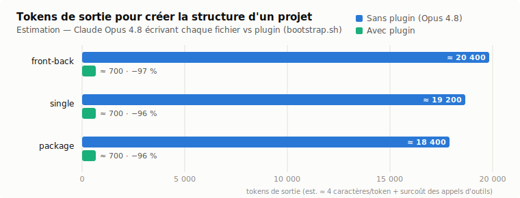

# bootstrap-claudecode-typescript

**Plugin Claude Code** d'initialisation rapide de projets **TypeScript / React**
(Next.js ou Vite) avec une structure standardisée : documentation (`README.md` +
`docs/`), `CLAUDE.md`, hooks et skills Claude Code, structure de tests, validation
des entrées **Zod**, lint (Biome + règle **max 300 lignes / fichier**) et workflows
CI (GitHub Actions ou GitLab CI).

> ⚠️ Plugin avant tout **personnel** : il encode *mes* conventions et habitudes de
> travail pour m'aider à bootstrapper mes projets rapidement. Utilisable par
> d'autres, mais les choix (structure, hooks, règles) reflètent ma façon de faire.

## Installation (plugin)

Le repo est à la fois un **plugin** et sa **marketplace** :

```bash
# dans Claude Code
/plugin marketplace add /Users/nicolasb/Desktop/bootstrap-claudecode-typescript
/plugin install bootstrap-claudecode-typescript@bootstrap-claudecode-typescript
```

(Une fois poussé sur GitHub : `/plugin marketplace add <owner>/bootstrap-claudecode-typescript`.)

Puis, depuis n'importe quel dossier :

```
/bootstrap-project
```

Claude pose les questions — type de projet (`front-back`, `single`, `package`),
framework (Next.js/Vite), CI (GitHub/GitLab), setup des tests (Jest + Stryker,
Cypress, Postman), tests d'acceptation (UAT), Storybook, dossier cible — puis
exécute le générateur et personnalise les fichiers.

## Utilisation en CLI (sans plugin)

```bash
./scripts/bootstrap.sh \
  --name mon-projet \
  --desc "Description courte du projet" \
  --layout front-back \        # ou : single (Next.js seul) | package (librairie npm)
  --framework nextjs \         # ou : vite
  --ci github \                # ou : gitlab | none
  --target ~/Desktop/mon-projet
  # options : --no-storybook --no-tests-setup --acceptance --no-git
```

L'auteur est **toujours le compte lié à la forge** : le générateur prend le compte
connecté à la CLI GitHub (`gh api user`), à défaut `git config user.name` ;
`--owner "Nom"` ne sert qu'à forcer explicitement une autre valeur.

## Ce qui est généré

| Élément | Contenu |
|---------|---------|
| `README.md` | Squelette standard : présentation, démarrage rapide (Make/Docker), liens docs |
| `CLAUDE.md` | Règles projet : workflow Git 2 branches, micro-features (`/create-feat`), mise en prod (`/merge-prod`), politique de tests, politique doc, intégrité CI, limite 300 lignes |
| `docs/` | 13 docs standards : architecture, testing, ci-cd, git-workflow, docker, tooling, security, accessibility, design, storybook, data-model, rgpd, ameliorations |
| `.claude/hooks/` | `check-test-location.sh`, `check-file-length.sh` (300 lignes), `check-new-dependency.sh`, `guard-model-usage.sh` (budget crédits), `remind-docs.sh`, `remind-tests.sh` |
| `.claude/settings.json` | Câblage des hooks PreToolUse / PostToolUse |
| `.claude/skills/` | `/create-issue` (template d'issue commun obligatoire, sans emoji), `/create-feat` (issue → branche dev → worktree → subagent → PR), `/merge-prod` (PR dev→main, CI vérifiée, merge humain), exemple |
| Structure `src/` | `interfaces/` (entités `IXxx` + `types.ts`), `schemas/` (validation **Zod**), `services/` (métier), `utils/`, `components/`, `views/`, `hooks/` |
| `shared/` (front-back) | Interfaces d'entités et schémas Zod **partagés entre front et back** (`shared/interfaces/`, `shared/schemas/`) — jamais de duplication |
| Tests | `front/tests/{unitaire,integration,e2e}` + `back/tests/{unitaire,integration,systeme}` (front-back), `tests/{unitaire,integration,e2e,systeme}` (single) ou `tests/{unitaire,integration}` (package) — avec configs **Jest**, **Stryker** (mutation), **Cypress** (e2e) et collection **Postman** (système API), et en option `tests/acceptance/` + UAT (disponibilité, sécurité, performance, robustesse) |
| Lint | `biome.json` + `scripts/check-max-lines.sh` (300 lignes) + `make lint` |
| CI | GitHub : `ci-dev-lint` (Biome + 300 lignes), `ci-dev-tests`, `ci-main-e2e`, `ci-main-system`, `ci-main-build` — ou GitLab : `.gitlab-ci.yml` équivalent |
| `Makefile` | Interface unique : install, dev, lint, test-* (unit, int, e2e, system, mutation, acceptance), storybook, docker-* |
| `.nvmrc` | Version Node unique (24 LTS) — lue par les workflows GitHub (`node-version-file`) ; l'image GitLab (`node:24`) se bumpe avec |
| Template d'issue | `.github/ISSUE_TEMPLATE/issue.md` ou `.gitlab/issue_templates/issue.md` — modèle **commun** (type bug/feature/documentation/autre, description, critères d'acceptation, impacts), imposé par le skill `/create-issue`, sans emoji |
| Git | `git init` + commit de bootstrap + branches `main` et `dev` |

## Benchmark — tokens économisés

Le générateur écrit 39 à 49 fichiers (~1 500 lignes) en une seule commande shell.
Sans le plugin, Claude Opus 4.8 devrait produire chaque fichier via des appels
`Write` — c'est-à-dire émettre tout leur contenu en tokens de sortie.

<picture>
  <source media="(prefers-color-scheme: dark)" srcset="assets/benchmark-dark.svg">
  
</picture>

| Layout | Fichiers | Lignes | Sans plugin (Opus 4.8, est.) | Avec plugin (est.) | Économie |
|---|---|---|---|---|---|
| `front-back` | 49 | ~1 600 | ≈ 20 400 tokens | ≈ 700 tokens | **≈ 97 %** |
| `single` | 43 | ~1 500 | ≈ 19 200 tokens | ≈ 700 tokens | **≈ 96 %** |
| `package` | 39 | ~1 450 | ≈ 18 400 tokens | ≈ 700 tokens | **≈ 96 %** |

**Méthodologie** (estimation, pas une mesure API) : contenu réellement généré par
`bootstrap.sh --acceptance` mesuré en caractères puis converti à ~4 caractères/token,
plus un surcoût d'environ 60 tokens par appel `Write` (chemin + enrobage JSON).
Côté plugin : chargement de la skill, un appel Bash et le résumé (~700 tokens).
L'économie réelle est supérieure : sans générateur, le modèle relit et raisonne
sur chaque fichier (tokens d'entrée et de réflexion non comptés ici), avec un
résultat moins déterministe d'une exécution à l'autre.

## Hooks embarqués

| Hook | Événement | Rôle |
|------|-----------|------|
| `check-test-location.sh` | PreToolUse (Write) | Bloque la création d'un fichier de test hors de `docs/testing.md`. |
| `check-new-dependency.sh` | PreToolUse (Bash/Write/Edit) | Nouvelle dépendance acceptée si **≥ 3 contributeurs ET publication < 6 mois**, OU **éditeur de confiance** (Meta, Google, Amazon, Microsoft, Vercel…) avec **≥ 1000 étoiles** — et dans tous les cas la version doit respecter **SemVer** (refus si non conforme **ou si l'information est indisponible**). |
| `check-file-length.sh` | PostToolUse (Write/Edit) | Alerte dès qu'un fichier source dépasse 300 lignes. |
| `remind-docs.sh` | PostToolUse (Write/Edit) | Rappelle de mettre à jour README/docs après une modification de code. |
| `remind-tests.sh` | PostToolUse (Write/Edit) | Rappelle la politique de tests (unitaire systématique ; intégration/e2e proposés). |
| `guard-model-usage.sh` | UserPromptSubmit | **Budget crédits** : > 50 % consommés et reset < 2 h → interdit Fable 5 / Opus en max effort ; < 50 % et reset < 1 h → message **violet** « Fable 5 utilisable à fond ». Estimation via `ccusage` ; nécessite `CREDITS_LIMIT_TOKENS` dans l'environnement. |

## Niveaux de tests (convention)

| Niveau | Côté | Emplacement | Nommage |
|--------|------|-------------|---------|
| unitaire | front | `front/tests/unitaire/` | `*.spec.ts(x)` |
| intégration | front | `front/tests/integration/` | `*.integration.spec.ts(x)` |
| e2e (navigateur) | front | `front/tests/e2e/` | `*.cy.ts` |
| unitaire | back | `back/tests/unitaire/` | `*.test.ts` |
| intégration | back | `back/tests/integration/` | `*.test.ts` |
| système (vrai serveur HTTP) | back | `back/tests/systeme/` | `*.test.ts` |

## Règle des 300 lignes

Aucun fichier source (`.ts`, `.tsx`, `.js`, `.jsx`) ne dépasse **300 lignes** :

- **En local / Claude Code** : hook `check-file-length.sh` (rappel immédiat après Write/Edit) ;
- **En CI** : le job lint (`ci-dev-lint` / job `lint` GitLab) exécute
  `scripts/check-max-lines.sh` et **échoue** en cas de dépassement ;
- **`make lint`** : Biome + vérification des 300 lignes.

## Cycle de vie d'une fonctionnalité

Penser **micro-features** (plan mode privilégié pour le découpage/l'orchestration) ;
pour chaque micro-feature, `/create-feat` impose : **issue** → **branche `feature/<nom>`
dérivée de `dev`** → **worktree dédié** → **subagent dédié** → **PR vers `dev`**.
La mise en production passe par `/merge-prod` (merge humain uniquement).

## Conventions de code

- **`src/interfaces/`** : toutes les interfaces d'entités, préfixées `I` (`IProduct`) ;
  `src/interfaces/types.ts` pour les alias de types purs uniquement.
- **Validation des entrées — Zod (obligatoire)** : toute entrée externe (body/query
  d'API, formulaire, webhook, env) est validée par un schéma Zod de `schemas/`
  (`product.schema.ts`) ; types dérivés par `z.infer`, jamais de cast direct.
  En layout front-back, les schémas communs vivent dans `shared/schemas/`.
- **Découpage par domaine métier** : quand l'app
  grandit, le code front se regroupe par domaine sous `src/@<domaine>/` (`@core`,
  `@vitrine`, `@shared`…), chaque domaine portant ses `components/`, `hooks/`,
  `services/`, `utils/`, `interfaces/`.
- **Composant = un dossier** : `components/Button/index.tsx` + styles/assets
  colocalisés (`button.module.css`) ; composants purs par défaut, les non-purs
  (store, réseau, auth) isolés dans `_notPure/`.
- **`views/` vs `pages/`** : `pages/` (ou `app/`) ne fait que le routage ; les
  sections d'écran composées vivent dans `src/views/<domaine>/`.
- **Nommage des fichiers** : PascalCase pour les composants et vues (`Button.tsx`,
  `HomeView.tsx`) ; minuscules pour tout le reste (services, hooks, utilitaires).
- **Nommage des symboles** : PascalCase pour les **interfaces** (`IProduct`), les
  **composants `.tsx`** et les **classes métier** de `services/` (`CartService`) ;
  camelCase pour tout le reste (fonctions, variables, hooks `useCart`).
- **`src/services/`** : logique **métier** (règles de gestion, appels API) — les hooks
  React ne portent que la logique de **rendu**. **`src/utils/`** : utilitaires purs
  transverses.
- **Semantic Versioning** : version du projet et releases taguées `vX.Y.Z` ; exigé
  aussi des dépendances (hook `check-new-dependency.sh`).
- **Micro-features** : plan mode privilégié pour le découpage/l'orchestration ; le
  processus `/create-feat` (issue → branche → worktree → subagent) s'applique dans
  tous les cas.

## Personnaliser

Les templates vivent dans `templates/`. Tokens substitués : `{{PROJECT_NAME}}`,
`{{PROJECT_DESC}}`, `{{OWNER}}`, `{{FRAMEWORK}}`. Modifier un template ici met à
jour tous les futurs projets.

## Développement du plugin

`./scripts/smoke-test.sh` génère les trois layouts dans un dossier temporaire et
vérifie les invariants : structure, substitution des tokens, filtrage CI par
layout, comportement des hooks. La CI du repo (`.github/workflows/ci.yml`)
l'exécute à chaque push/PR.
